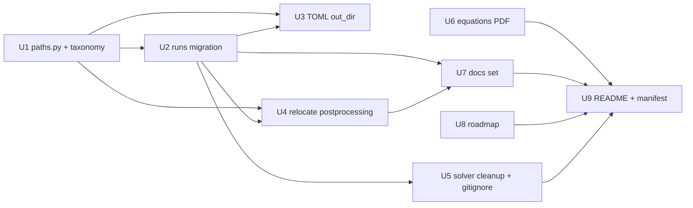

# refactor: Reorganize fuzzy-couscous repo

## Summary

Reorganize the repository **without changing any solver physics or numerics**. The
work consolidates ~175 GB of scattered run outputs into one categorized `runs/` tree
(a reversible, same-filesystem move), introduces a single shared path-resolution
module so every Python analysis script resolves data from one place, relocates all
post-processing under `postprocessing/{tools,scripts}/`, normalizes the 90 TOML
`out_dir` values to a consistent scheme, cleans stray build/run artifacts out of the
solver tree (leaving `solver/src/` untouched), produces detailed `docs/` documentation
**plus** a LaTeX-built governing-equations PDF, refreshes the README with
requirements/run instructions and a Python dependency manifest, and adds a
consolidated future-work roadmap.

This is a **Deep** plan: it is cross-cutting (runs, configs, scripts, docs, README,
build conventions, `.gitignore`) and the couplings between these surfaces are the main
risk. It is sequenced into phases that map naturally to separate pull requests onto
`main`.

**Prerequisite (already satisfied):** the two open PRs (#2 spectra, #3 abv) were
merged into `main` on 2026-05-23; the reorg branches off the updated `main`.

---

## Problem Frame

The repository grew organically during a clean-room solver rebuild, and the
non-source assets are now scattered and inconsistently wired:

- **Run outputs live in four places** — `runs/` (133 G), `scaling/runs_*` + `logs_*` +
  `pgo_*` (33 G), `solver/runs/` (9.6 G), and `solver/out_*` — all gitignored, all on
  the same filesystem (`/work`, so `mv` is instant).
- **Two conflicting output conventions.** 78 of 90 example TOMLs write a *bare*
  `out_dir = "out_..."` (lands in the current working directory, usually `solver/`),
  while 12 use `out_dir = "runs/out_..."`. Analysis scripts mirror the split: most use
  `RUNS = ROOT/"runs"`, but several use `RUNROOT = ROOT/"solver"` to read the bare-CWD
  outputs. There is no single source of truth for where a run lives.
- **Post-processing is spread across three folders** — `scripts/` (35 `.py`), `tools/`
  (6 `.py` + README), and `scaling/` (7 `.py`) — with a web of cross-folder imports
  (`scripts/spectrum_components.py` does `sys.path.insert(ROOT/"tools")`;
  `scripts/total_spectrum_windows.py` imports `spectrum_components`; etc.) and a fragile
  `ROOT = Path(__file__).resolve().parent.parent` anchor that breaks the moment a script
  changes directory depth.
- **The solver tree carries strays** — five build directories (`build_mpi/` at repo
  root plus `solver/build`, `solver/build_abv`, `solver/build_mpi`, `solver/build_pgo`)
  and stale `solver/out_*` run dirs — and the build-output location is itself
  inconsistent (`configure-mpi.sh` builds to repo-root `build_mpi/`, README serial
  builds to `solver/build`, scaling drivers expect `solver/build_mpi`).
- **Documentation gaps.** There is no governing-equations reference, no consolidated
  capability/numerics document set, no future-work roadmap, and no Python dependency
  manifest. The README is detailed but mixes overview, deep reference, and how-to-run.

The result: a newcomer (or the author, months later) cannot tell where a run came
from, cannot reliably re-run a config into a predictable location, and cannot run the
analysis scripts without first reverse-engineering the path conventions.

---

## Goals & Non-Goals

**Goals**
- One categorized `runs/` tree holding every run output, with a manifest recording
  provenance and the old→new mapping.
- A single shared path module (`postprocessing/paths.py`) that resolves the repo root,
  `runs/`, `data/`, `figs/`, and any named run directory — adopted by every script so
  the analysis pipeline is robust to relocation.
- One consistent `out_dir` convention across all 90 TOML configs.
- All post-processing under `postprocessing/{tools,scripts}/`, imports and anchors
  fixed, with a smoke-import test proving everything still loads.
- A clean solver tree (strays removed, build convention documented and unified) with
  `solver/src/`, `solver/examples/`, `solver/tests/`, `solver/run_mpi.sh`, and
  `solver/cmake/configure-mpi.sh` preserved.
- Detailed `docs/` reference set + a built governing-equations PDF + a future-work
  roadmap, and a refreshed README with a Python dependency manifest.

**Non-Goals**
- No change to solver physics, numerics, or behavior. No edits to `solver/src/`
  internals beyond what a path/convention change strictly requires (expected: none).
- No re-running of simulations to regenerate data; existing outputs are moved, not
  recomputed.
- No restructuring of `solver/src/` subdirectories — they are already cleanly divided
  (`bc, core, diagnostics, ic, io, numerics, parallel, physics, turbulence`).
- No deletion of run data. The consolidation is a move with a reversible manifest.

---

## Scope Boundaries

### In scope
- Filesystem consolidation of all run-output directories into `runs/<category>/`.
- The shared `postprocessing/paths.py` module and adoption across all scripts.
- Normalization of all `solver/examples/*.toml` `out_dir` values.
- Relocation of `scripts/`, `tools/`, and `scaling/*.py` post-processing into
  `postprocessing/`.
- Solver-tree artifact cleanup and build-convention unification.
- `.gitignore` updates for the new layout.
- `docs/` documentation set, governing-equations LaTeX→PDF, future-work roadmap.
- README refresh + `requirements.txt` (and optional `environment.yml`).
- Cross-reference sweep (STRATEGY.md, `docs/solutions/`, README) to new paths.

### Out of scope (true non-goals)
- Any solver behavior/physics/numerics change.
- Regenerating or re-validating simulation data.
- Restructuring `solver/src/`.

### Deferred to Follow-Up Work
- Pruning the merged remote/local branches `abv-artificial-diffusivity` and
  `spectra-energy-vs-turbulence` (optional cleanup; can be done anytime).
- Migrating `data/` (derived `.npz` products) into the `runs/` tree — kept at repo root
  as the derived-products directory for this reorg to limit blast radius; revisit if a
  unified `runs/_derived/` proves cleaner.
- Capturing the reorg learnings via `/ce-compound` once landed (path-anchoring pattern,
  `runs/` taxonomy, `out_dir` convention, LaTeX/PDF build) — the `docs/solutions/`
  knowledge base currently has only one entry, so this is high value.

---

## Output Structure

Target top-level layout after the reorg (illustrative; the per-unit `Files:` sections
are authoritative):

```
runs/                         all run outputs (gitignored data; tracked manifest)
  MANIFEST.md                 old->new mapping + provenance (tracked)
  README.md                   taxonomy + how runs are named (tracked)
  blast/      out_blast_*/
  tgv/        out_tgv*/
  bhr/        out_bhr*/  out_rans*/
  chamber/    out_*_chamber_*/
  tnt/        out_tnt_*/
  scaling/    runs_c*/  logs_*/  pgo_*/  (from scaling/)
data/                         derived .npz products + run logs (gitignored, unchanged)
figs/                         plotting output (gitignored pngs; tracked mp4s, unchanged)
postprocessing/
  paths.py                    shared repo-root / runs / data / figs / run_dir() resolver
  README.md                   analysis pipeline guide
  tools/                      reusable utilities (was tools/)
  scripts/                    case-specific analyses (was scripts/ + scaling/*.py)
  tests/test_paths.py         resolver unit tests + smoke-import of every script
solver/
  src/  examples/  tests/  cmake/  CMakeLists.txt  run_mpi.sh   (unchanged layout)
docs/
  capabilities.md  numerics.md  diagnostics.md  mpi.md
  runs.md  postprocessing.md  roadmap.md
  equations/governing-equations.tex  governing-equations.pdf  Makefile
  solutions/                  (unchanged)
  plans/                      (this plan)
README.md                     overview + requirements + how-to-run + pointers to docs/
requirements.txt              Python deps for post-processing
STRATEGY.md                   (unchanged content; path refs updated)
```

> The categorization above is the proposed default. The exact taxonomy is a judgment
> call driven by run-name prefix; the migration is data-driven and reversible, so the
> mapping can be adjusted during execution without re-architecting the plan.

---

## Key Technical Decisions

1. **Runs move is real and reversible, not a copy.** All run outputs are on one
   filesystem, so `mv` is instant. The migration is driven by a generated manifest
   (`runs/MANIFEST.md`) recording every old→new path, enabling a one-command rollback.
   The 175 GB is gitignored, so **none of it appears in any PR** — the move is a local
   filesystem operation `ce-work` performs; the PR content is the manifest, the
   migration script, and the convention/TOML/script edits.

2. **A shared `postprocessing/paths.py` is the "connect everything" mechanism.**
   Rather than re-deriving `parent.parent` anchors after the move, every script imports
   `from paths import REPO_ROOT, RUNS, DATA, FIGS, run_dir`. `run_dir("out_blast_128_x")`
   encapsulates the category mapping (`runs/blast/out_blast_128_x`), so scripts never
   hardcode a category and a future re-categorization touches one file. This directly
   answers "rewrite scripts so everything is connected" and makes the wiring testable.

3. **One `out_dir` convention: `runs/<category>/<name>`.** All 90 TOMLs are normalized
   so re-running any config writes into the unified tree, matching where `run_dir()`
   looks. This removes the bare-CWD vs. `runs/`-prefixed split.

4. **`postprocessing/` parents the two existing tiers.** Per the chosen split,
   `tools/` (reusable) and `scripts/` (case-specific) become `postprocessing/tools/`
   and `postprocessing/scripts/`; `scaling/*.py` plotting joins `postprocessing/scripts/`.
   `scaling/` retains only its run *drivers* (`run_*.sh`) and committed results tables.

5. **Build convention unified under `solver/`.** The majority of drivers (scaling, the
   existing `solver/build*` dirs, README serial) assume builds under `solver/`. Standardize
   on `solver/build` (serial) and `solver/build_mpi` (MPI); update `configure-mpi.sh`
   (`-B build_mpi` → `-B solver/build_mpi`) and README MPI accordingly. Preserve
   `solver/run_mpi.sh` and `solver/cmake/configure-mpi.sh` (documented MPI ABI workaround,
   see `docs/solutions/build-errors/mpi-build-fftw3-and-mpi-abi-mismatch-2026-05-17.md`).

6. **Equations PDF via LaTeX, committed alongside source.** Install the `tectonic`
   single binary (no root; falls back to apt `texlive` if available). Source lives at
   `docs/equations/governing-equations.tex` with a `make` target; both `.tex` and built
   `.pdf` are committed (add a `.gitignore` exception `!docs/equations/*.pdf`, since
   `*.pdf` is globally ignored except `paper/figures/`).

7. **`data/` stays at repo root.** It holds derived `.npz` products and run logs (not
   raw run outputs) and is referenced by many scripts as `DATA = ROOT/"data"`. Keeping
   it limits blast radius; the resolver still centralizes the anchor. (Revisit per
   Deferred work.)

8. **Documentation is dual-track ("both detailed").** Deep reference content moves into
   `docs/` files; the README stays detailed but is reorganized around overview →
   requirements → how-to-run → pointers. Some intentional overlap is accepted.

---

## High-Level Technical Design

*This illustrates the intended approach and is directional guidance for review, not
implementation specification. The implementing agent should treat it as context, not
code to reproduce.*

The path resolver is the keystone — it absorbs both the directory-depth change and the
run categorization so individual scripts need only swap their anchor block for an import:

```
# postprocessing/paths.py  (sketch)
REPO_ROOT = <walk up from __file__ until a repo marker (.git / solver/) is found>
RUNS, DATA, FIGS = REPO_ROOT/"runs", REPO_ROOT/"data", REPO_ROOT/"figs"

CATEGORY_RULES = [ ("out_tgv", "tgv"), ("out_bhr", "bhr"), ("out_rans", "bhr"),
                   ("*_chamber_*", "chamber"), ("out_tnt", "tnt"),
                   ("out_blast", "blast"), ... ]   # first match wins

def run_dir(name) -> Path:        # "out_blast_128_x" -> RUNS/"blast"/"out_blast_128_x"
    return RUNS / category_of(name) / name
```

```
# per-script change (sketch) — before:
ROOT = Path(__file__).resolve().parent.parent
RUNS = ROOT / "runs"; DATA = ROOT / "data"
rd = RUNS / "out_blast_128_budget_seed1"
# after:
from paths import RUNS, DATA, run_dir
rd = run_dir("out_blast_128_budget_seed1")
```

Migration flow:

```mermaid
flowchart TD
    A[scan run dirs: runs/, solver/runs/, solver/out_*, scaling/runs_*|logs_*|pgo_*] --> B[classify each by name prefix -> category]
    B --> C[write runs/MANIFEST.md: old path -> new path]
    C --> D[mv each into runs/<category>/ (same FS, instant)]
    D --> E[normalize 90 TOML out_dir -> runs/<category>/<name>]
    E --> F[adopt paths.py in scripts; relocate to postprocessing/]
    F --> G[smoke-import test + resolver unit test]
```

---

## Implementation Units

Units carry stable U-IDs. Phases map to suggested PRs.

### Phase 1 — Foundation (PR1)

### U1. Shared path-resolution module + run taxonomy

**Goal:** Create `postprocessing/paths.py` providing `REPO_ROOT`, `RUNS`, `DATA`,
`FIGS`, and `run_dir(name)` / `category_of(name)`, encoding the run-category taxonomy in
one place. No files move yet; this is the foundation everything else builds on.

**Requirements:** "rewrite scripts so everything is connected"; single source of truth
for run locations.

**Dependencies:** none.

**Files:**
- `postprocessing/paths.py` (new)
- `postprocessing/tests/test_paths.py` (new)
- `postprocessing/__init__.py` and/or `conftest.py` as needed for import resolution

**Approach:** `REPO_ROOT` walks upward from `__file__` looking for a stable marker
(`.git/` or `solver/CMakeLists.txt`) so it is independent of script depth. `category_of`
applies ordered prefix/glob rules (first match wins) with a documented fallback
(`misc/`). `run_dir` joins `RUNS/category/name`. Keep the module dependency-free
(stdlib `pathlib` only) so it imports anywhere.

**Patterns to follow:** mirror the existing `ROOT = Path(__file__).resolve()...` idiom
but centralize it; keep naming (`RUNS`, `DATA`) identical to current globals so script
edits are near-mechanical.

**Test scenarios:**
- `REPO_ROOT` resolves to the repo root when imported from `postprocessing/`,
  `postprocessing/scripts/`, and `postprocessing/tools/` (depth independence).
- `category_of("out_blast_128_budget_seed1") == "blast"`; `"out_tgv128_hyper2" -> "tgv"`;
  `"out_bhr_64" -> "bhr"`; `"out_rans_bhr" -> "bhr"`; `"out_tnt_freeair_128" -> "tnt"`;
  `"out_tnt_chamber_128" -> "chamber"` (chamber rule precedes the bare `tnt` rule);
  unknown prefix -> documented fallback.
- `run_dir("out_blast_64_cj")` returns `REPO_ROOT/"runs"/"blast"/"out_blast_64_cj"`.
- Edge: empty string and a name already containing a slash raise or normalize per a
  documented rule (no silent wrong path).

**Verification:** `pytest postprocessing/tests/test_paths.py` passes; module imports
with only the standard library.

---

### Phase 2 — Runs consolidation (PR2)

### U2. Reversible runs migration + manifest + category tree

**Goal:** Move every run output into `runs/<category>/`, generating a manifest that
records provenance and the old→new mapping and supports rollback.

**Requirements:** "make all the runs in one folder"; "make appropriate notes" (per-tree
provenance manifest).

**Dependencies:** U1 (taxonomy/`category_of`).

**Files:**
- `postprocessing/scripts/migrate_runs.py` (new) — scan, classify, dry-run, apply,
  rollback modes; uses `paths.category_of`
- `runs/MANIFEST.md` (new, tracked) — generated old→new table + timestamps
- `runs/README.md` (new, tracked) — taxonomy and naming conventions
- `runs/<category>/.gitkeep` for each category (so the tree shape is tracked)
- Filesystem moves (not git-tracked): `runs/out_*`, `solver/runs/out_*`,
  `solver/out_*`, `scaling/runs_*`, `scaling/logs_*`, `scaling/pgo_*`,
  `scaling/pgo_profile`

**Approach:** Default to **dry-run** emitting the proposed manifest for review; `--apply`
performs `mv` (same filesystem → atomic rename); `--rollback` reads the manifest and
reverses. Idempotent and safe to re-run. Because the data is gitignored, the PR contains
only the script + manifest + README + `.gitkeep`s; the bulk move is a local operation.

**Execution note:** Run dry-run first and have the operator eyeball the manifest before
`--apply` — this is a 175 GB operation and the manifest is the rollback contract.

**Patterns to follow:** the `sed`-based per-run TOML cloning in `scaling/run_sweep.sh`
shows the existing convention for run identity; preserve run-dir names exactly (only the
parent changes).

**Test scenarios:**
- Dry-run on a temp fixture tree (a handful of fake `out_*` dirs across the four source
  locations) produces a manifest mapping each to the correct `runs/<category>/`.
- `--apply` then `--rollback` on the fixture returns the tree to its original state
  (byte-for-byte dir listing equality).
- Re-running `--apply` when already migrated is a no-op (idempotent), not an error.
- A run dir whose name matches no rule lands in the documented fallback category and is
  flagged in the manifest, not silently dropped.

**Verification:** after `--apply`, `ls runs/*/` shows all former outputs under
categories; `runs/MANIFEST.md` lists every move; no run directory remains under
`solver/` or `scaling/`.

### U3. Normalize all TOML `out_dir` values

**Goal:** Rewrite the 90 `solver/examples/*.toml` `out_dir` values to the single
`runs/<category>/<name>` convention so re-running writes into the unified tree.

**Requirements:** one consistent output convention; "everything connected".

**Dependencies:** U1 (taxonomy), U2 (target tree exists).

**Files:**
- all 90 `solver/examples/*.toml` (modify `out_dir` only)
- `solver/examples/scaling_case1_256.toml`,
  `solver/examples/scaling_case1_64_pgo_train.toml`,
  `solver/examples/tgv_re1600_64_hyper2_pgo_train.toml` (referenced by scaling drivers —
  keep consistent; note these are cloned+`sed`-rewritten at run time)

**Approach:** A scripted rewrite (reusing `category_of`) maps each existing `out_dir`
basename to `runs/<category>/<basename>`. Verify the relative path is correct given the
documented run CWD (repo root). Leave every other TOML field untouched. Confirm the
solver accepts a nested `out_dir` and creates intermediate directories (check
`Config`/`HDF5Writer` dir-creation behavior; if it does not `mkdir -p`, note as a small
solver-side follow-up rather than silently relying on it).

**Test scenarios:**
- Every `out_dir` post-edit matches `^runs/(blast|tgv|bhr|chamber|tnt|scaling|misc)/`.
- A representative config run end-to-end (e.g. `chamber_smoke.toml`) writes its output
  under the expected `runs/<category>/` path and the analysis resolver finds it.
- `git diff` on each TOML shows only the `out_dir` line changed.

**Verification:** `grep -L 'out_dir.*runs/' solver/examples/*.toml` is empty; a smoke
run lands in the unified tree.

---

### Phase 3 — Post-processing relocation (PR3)

### U4. Relocate scripts/tools/scaling-plots into `postprocessing/` and rewire

**Goal:** Move all post-processing under `postprocessing/{tools,scripts}/`, adopt
`paths.py` everywhere, fix cross-folder imports and run-name references, and pull
`scaling/*.py` plotting in. Add a smoke-import test.

**Requirements:** "post-processing scripts in a separate folder"; "rewrite scripts so
everything is connected".

**Dependencies:** U1 (paths module), U2 (runs moved so resolver targets exist).

**Files:**
- `git mv scripts/*.py -> postprocessing/scripts/` (35 files)
- `git mv tools/*.py -> postprocessing/tools/` (6 files) + `tools/README.md ->
  postprocessing/tools/README.md`
- `git mv scaling/{plot_*,parse_steps}.py -> postprocessing/scripts/` (7 files)
- edit each moved script: replace the `ROOT = ...parent.parent` + `RUNS/DATA/RUNROOT`
  block with `from paths import ...`; replace `RUNS / "out_..."` and `RUNROOT/"solver"/...`
  references with `run_dir(...)`
- fix cross-folder imports: `sys.path.insert(ROOT/"tools")` /
  `sys.path.insert(ROOT/"scripts")` → resolve siblings within `postprocessing/`
- `postprocessing/tests/test_paths.py` (extend U1 test with a smoke-import of every
  module)
- `postprocessing/README.md` (new) — analysis pipeline guide
- `scaling/run_*.sh` — update `RUN_ROOT` to `runs/scaling/...` and any plot-script paths

**Approach:** Move first (preserve history via `git mv`), then mechanically swap anchors.
The `RUNROOT = ROOT/"solver"` scripts (`ic_compare_mf_sg`, `compare_mf_sg_spectra`,
`compare_multifluid_singlegas`, `movie_mf_evolution`, `movie_tnt`) change from reading
`solver/out_*` to `run_dir(name)` since those runs moved in U2. Keep `figs/` as the
figure-output target (`FIGS` from the resolver). Make `postprocessing/` importable
(package `__init__.py` or a `conftest.py`/`sys.path` shim) so `from paths import ...`
works whether a script is run as `python postprocessing/scripts/x.py` or imported.

**Execution note:** Add a failing smoke-import test first (import every module under
`postprocessing/`), then fix anchors until green — this is the cheapest guard against a
missed reference among 48 files.

**Patterns to follow:** the existing `sys.path.insert` idiom for sibling imports; keep
each script's CLI/argparse surface unchanged so existing invocations still work (only
the path resolution changes).

**Test scenarios:**
- Smoke-import: importing every module under `postprocessing/` succeeds (no
  `ModuleNotFoundError`, no path-anchor `FileNotFoundError` at import time).
- `total_spectrum_windows` still imports `spectrum_components`; `spectrum_components`
  still imports the spectrum-shape utility now under `postprocessing/tools/`.
- A representative end-to-end script (e.g. `plot_blast_128.py` or `fit_decay.py`) run
  against a migrated run resolves its inputs via `run_dir`/`RUNS` and writes the expected
  figure under `figs/`.
- `scaling/run_sweep.sh --help`/dry path-check shows `RUN_ROOT` pointing into
  `runs/scaling/` and `BIN` at `solver/build_mpi/blast_les_mpi`.

**Verification:** `pytest postprocessing/tests/` green; `git log --follow` on a moved
script shows preserved history; `grep -rn "parent.parent" postprocessing/` returns
nothing (all anchors centralized).

---

### Phase 4 — Solver tree cleanup (PR4)

### U5. Clean solver strays, unify build convention, update `.gitignore`

**Goal:** Remove stray build/run artifacts, standardize the build-output location, and
update `.gitignore` for the new layout — without touching `solver/src/`.

**Requirements:** "check if the current source files are properly organized" (they are —
the action is cleaning around them); consistent build convention.

**Dependencies:** U2 (solver run outputs already moved).

**Files:**
- delete (untracked, gitignored): repo-root `build_mpi/`, `solver/build`,
  `solver/build_abv`, `solver/build_mpi`, `solver/build_pgo`, any leftover `solver/out_*`
- `solver/cmake/configure-mpi.sh` — `-B build_mpi` → `-B solver/build_mpi`
- `.gitignore` — confirm `out_*/` still ignores `runs/<cat>/out_*/`; add
  `!docs/equations/*.pdf`; keep build-dir ignores; add `runs/**/.gitkeep` allowance and
  ensure `runs/MANIFEST.md`/`runs/README.md` are tracked
- **preserve unchanged:** `solver/run_mpi.sh`, `solver/cmake/configure-mpi.sh` purpose,
  `solver/CMakeLists.txt` source list, `solver/tests/`, `solver/examples/` location

**Approach:** Build directories are regenerable, so deletion is safe; the value is
removing ambiguity. Standardize on `solver/build` + `solver/build_mpi` because scaling
drivers and the existing tree already assume `solver/`. Verify a fresh serial and MPI
configure+build+ctest still pass from a clean tree after the convention change.

**Test scenarios (verification-heavy; no new behavior):**
- Fresh serial build: `cmake -S solver -B solver/build ... && cmake --build solver/build
  && ctest --test-dir solver/build` passes (44 serial tests).
- Fresh MPI build via `solver/cmake/configure-mpi.sh && cmake --build solver/build_mpi`
  then `solver/run_mpi.sh ctest --test-dir solver/build_mpi` passes (MPI tests at N=1,2,4).
- `git status` is clean after deleting the gitignored build/run strays (they were never
  tracked).
- A `.pdf` placed under `docs/equations/` is no longer ignored; a `.pdf` elsewhere still
  is.

**Verification:** both builds green from clean; no stray `build*`/`out_*` dirs remain
outside `runs/`; `.gitignore` documents each rule.

---

### Phase 5 — Documentation (PR5)

### U6. Governing-equations LaTeX source + built PDF

**Goal:** Author `docs/equations/governing-equations.tex` covering every governing
equation the solver implements, with a reproducible build to PDF.

**Requirements:** "a pdf file listing all relevant governing equations".

**Dependencies:** none (content sourced from `solver/src/` + README); independent of the
moves.

**Files:**
- `docs/equations/governing-equations.tex` (new)
- `docs/equations/Makefile` (new) — `make` builds the PDF via `tectonic` (fallback
  `latexmk`/`pdflatex`)
- `docs/equations/governing-equations.pdf` (new, committed)
- `docs/equations/README.md` (new) — how to build, toolchain install note

**Approach:** Install `tectonic` (single binary, no root) into a local path; document
the install. Cover: compressible Navier–Stokes in conservative form (continuity,
momentum, total energy); inviscid Euler flux; viscous Stokes stress tensor with bulk
viscosity + Fourier heat flux; EOS set (ideal gas, two-gamma mixture, JWL with the TNT
constants); multifluid marker advection (`G = 1/(γ−1)` and products mass fraction φ);
LES hyperdissipation `ν_h ∇⁴U`; localized artificial diffusivity + Ducros sensor;
BHR turbulence-model equations; SSP-RK3 update; diagnostic identities (Helmholtz
decomposition, `ε_sol`/`ε_dil`, shell-averaged spectra). Cross-check every equation
against its implementation file and cite the file in a margin/footnote so the PDF stays
traceable to code.

**Test scenarios:** `Test expectation: none — document artifact.` Verification is the
successful build and an equation-vs-code spot check.

**Verification:** `make` in `docs/equations/` produces a non-empty PDF; a reviewer
confirms each major equation maps to a `solver/src/` file (e.g. JWL ↔ `physics/JWL.hpp`,
hyperdissipation ↔ `numerics/HyperdissipationSpectral.cpp`, dissipation budget ↔
`diagnostics/Statistics.cpp`).

### U7. Detailed `docs/` reference set

**Goal:** Author the deep capability/numerics/diagnostics/MPI/runs/post-processing docs.

**Requirements:** "updated documentation on the solver capabilities".

**Dependencies:** U2, U4 (so paths/layout described are final); U6 can cross-link.

**Files:**
- `docs/capabilities.md`, `docs/numerics.md`, `docs/diagnostics.md`, `docs/mpi.md` (new)
- `docs/runs.md` (new) — the `runs/` taxonomy, naming, manifest, how to add a run
- `docs/postprocessing.md` (new) — the analysis pipeline, `paths.py`, tools vs scripts
- link the MPI ABI workaround from `docs/solutions/build-errors/...` per the learnings note

**Approach:** Migrate the deep reference material currently embedded in the README
(numerical-method table, EOS/multifluid section, diagnostics, MPI implementation table,
test-suite table) into focused `docs/` files; expand with capability coverage. Keep the
content authoritative and code-traceable.

**Test scenarios:** `Test expectation: none — documentation.` Verify links resolve and
described paths exist post-move.

**Verification:** every relative link in `docs/*.md` resolves; described file paths exist.

### U8. Future-work roadmap

**Goal:** One consolidated roadmap of deferred/future work.

**Requirements:** "make appropriate notes so that all futures are noted".

**Dependencies:** none.

**Files:** `docs/roadmap.md` (new)

**Approach:** Consolidate known deferred items: JWL afterburning (reactive heat
release); the DCT spectra wavenumber convention (π/L → 2π/L) open question; the
multifluid double-flux non-conservation study; multi-node MPI scaling for 768³
ensembles; the experimental-data cross-check (manuscript reference data TBD); and any
TODOs surfaced during the reorg. Group by track to mirror `STRATEGY.md`, with context
and a pointer to the relevant code/test for each.

**Test scenarios:** `Test expectation: none — documentation.`

**Verification:** roadmap reviewed against `STRATEGY.md` tracks and memory notes; each
item has enough context to be actionable later.

---

### Phase 6 — README + manifest + cross-references (PR6)

### U9. README refresh, Python dependency manifest, cross-reference sweep

**Goal:** Reorganize the README around overview → requirements → how-to-run → pointers;
add a Python dependency manifest; update every path reference repo-wide to the new
locations.

**Requirements:** "updated README with code requirements, language, tools needed to run".

**Dependencies:** U2, U4, U5, U6, U7, U8 (README documents the final state and links the
new docs).

**Files:**
- `README.md` (restructure; keep detail per "both detailed", point deep sections to
  `docs/`)
- `requirements.txt` (new) — `numpy`, `pandas`, `h5py`, `matplotlib`, `scipy` (pin from
  the running environment); optional `environment.yml`
- `STRATEGY.md` (update `tools/fit_decay.py` → `postprocessing/tools/fit_decay.py`)
- sweep `docs/**` and any script docstrings for stale `scripts/`/`tools/`/`solver/out_*`
  paths

**Approach:** README states language/standard (C++20 + OpenMP, optional MPI), build
toolchain and library requirements (GCC≥13/Clang≥17, CMake≥3.20, FFTW3, HDF5, spdlog,
toml++, GoogleTest; MPI extras), Python requirements (`requirements.txt`), the LaTeX
toolchain for the equations PDF, the new directory layout, and how to build/run/analyze.
Verify the dependency list against what the code actually imports/links.

**Test scenarios:**
- A clean-checkout reader can, following only the README, install Python deps from
  `requirements.txt` and run one post-processing script successfully.
- `grep -rn "scripts/\|tools/" README.md STRATEGY.md docs/` shows no stale pre-move paths
  (all updated to `postprocessing/...`).
- The documented build commands match the unified `solver/build` + `solver/build_mpi`
  convention from U5.

**Verification:** README build/run/analyze commands execute as written against the
reorganized tree; `requirements.txt` installs cleanly into a fresh venv.

---

## Dependencies & Sequencing



U6 and U8 are independent and can proceed in parallel with the move phases. U1 must land
first; U9 last.

---

## Phased Delivery (suggested PRs onto `main`)

| PR | Units | Git-visible content | Notes |
|----|-------|---------------------|-------|
| PR1 | U1 | `postprocessing/paths.py` + tests | Foundation; no moves; fully reviewable |
| PR2 | U2, U3 | migration script, `runs/MANIFEST.md`, `runs/README.md`, `.gitkeep`s, 90 TOML edits | 175 GB move is local (gitignored); PR is small |
| PR3 | U4 | `git mv` of 48 scripts + anchor edits + smoke test | History preserved via `git mv` |
| PR4 | U5 | `configure-mpi.sh`, `.gitignore` | Build strays are untracked deletions |
| PR5 | U6, U7, U8 | `docs/equations/*`, `docs/*.md` | Equations PDF committed |
| PR6 | U9 | `README.md`, `requirements.txt`, xref sweep | Documents final state |

---

## Risk Analysis & Mitigation

| Risk | Likelihood | Impact | Mitigation |
|------|-----------|--------|-----------|
| A script reference is missed and silently reads the wrong/empty path | Med | Med | Centralize in `paths.py` (U1); smoke-import + resolver tests (U1/U4); `grep` for residual `parent.parent` / `RUNROOT` |
| 175 GB move interrupted or partially applied | Low | High | Same-FS atomic `mv` per dir; manifest written before moving; idempotent `--apply`; `--rollback` from manifest (U2) |
| `out_dir` nesting fails because solver doesn't `mkdir -p` | Low | Med | U3 verifies dir-creation behavior; if absent, flag a tiny solver-side follow-up rather than relying on it silently |
| Build-convention change breaks scaling drivers or MPI build | Low | Med | U5 rebuilds serial+MPI from clean and runs ctest; scaling `BIN` path re-checked in U4 |
| `tectonic`/LaTeX install blocked (no network/root) | Med | Med | Single-binary `tectonic` needs no root; document fallback; if fully blocked, U6 is the one at-risk deliverable — surface immediately rather than faking the PDF |
| `git mv` history not preserved if done as delete+add | Low | Low | Use `git mv`; verify with `git log --follow` (U4) |
| Equations PDF drifts from code | Med | Low | Cite the implementing file per equation (U6); roadmap notes to re-check on physics changes |

---

## Future Considerations

- After landing, run `/ce-compound` to capture the path-anchoring pattern, the `runs/`
  taxonomy, the `out_dir` convention, and the LaTeX/PDF build — the `docs/solutions/`
  base currently has a single entry, so these are high-value learnings.
- Consider promoting `postprocessing/` to an installable package (`pyproject.toml`) so
  `paths` imports work without a `sys.path` shim and scripts gain console entry points.
- Revisit folding `data/` into `runs/_derived/` once the new layout has settled.
